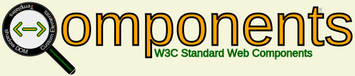

# Web Components Inspector

## Todo

* Table formatting JSON: https://gist.github.com/Danny-Engelman/f094e15d87797fc2205a0808db8bbeb5

### EventListeners

* F12 tools has getEventListeners() function

* Record all used EventListeners via an extra Qomponents method

## Resources

* https://github.com/webcomponents/chrome-webcomponents-extension - last update 2014!

* https://github.com/pankajpatel/inspector-component - unclear What is does
Modelled after [React-Inspector](https://github.com/storybookjs/react-inspector) - show F12 output **inside** App

* [Open-WC Locator](https://github.com/open-wc/locator) - doesn't find all components in the page, uses "-" String checking to identify Custom Elements